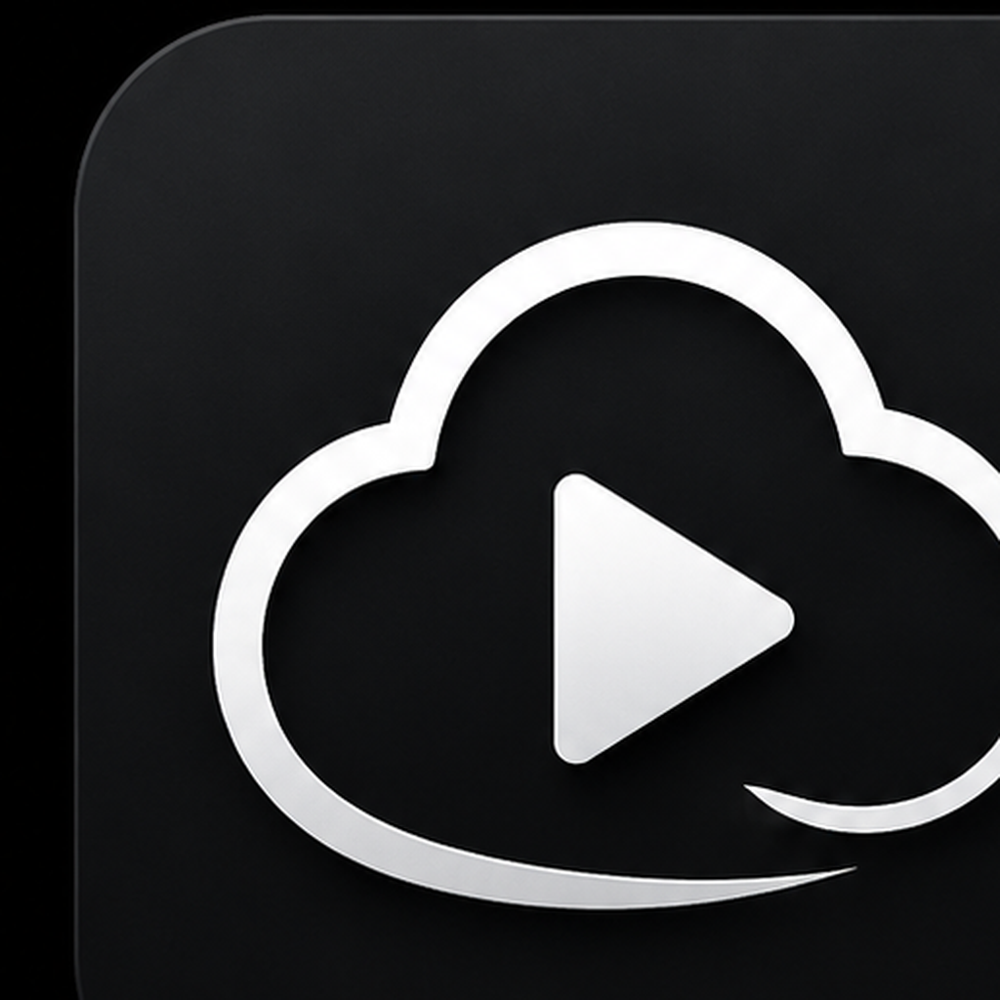

<p align="center">
  
</p>

<h1 align="center">Cloud Player</h1>

<p align="center"><strong>v1.0</strong></p>

<p align="center">
  <strong>Your media. Any cloud.</strong><br>
  A unified cloud media player for Android, Android TV, and Android Auto.
</p>

<p align="center">
  <strong>Android</strong> · <strong>Android TV</strong> · <strong>Android Auto</strong>
</p>

---

## About

Cloud Player is a provider-neutral fork inspired by pCloudTV. The goal is simple:

> Your media belongs to you, not your storage provider.

Cloud Player is built to browse, stream, and play your media from cloud libraries while keeping the player independent from the storage backend.

## v1.0 Focus

This first version establishes Cloud Player as its own app and brand.

- New **Cloud Player** app name.
- New provider-neutral monochrome icon.
- New package/application identity: `com.typezero.cloudplayer`.
- Version reset to **v1.0**.
- pCloud remains the first working provider.
- Multi-provider architecture foundation is preserved for future services.

## Active Provider

- pCloud

## Planned Providers

- MEGA
- Google Drive
- Dropbox
- OneDrive
- SMB
- WebDAV
- Nextcloud

## Features

- Stream video and music from cloud storage.
- Android TV support.
- Android Auto audio support.
- Playlist support.
- Audiobooks folder support.
- Resume playback.
- Queue handling.
- Cast support.
- Real-time music visualizer when permission is granted.

## Visualizer Permission Note

The real-time audio visualizer uses Android audio capture APIs and requires the **Microphone** permission. If permission is not granted, the visualizer may use fallback motion instead of live audio-reactive bars.

On Android TV, grant the permission from:

```text
Settings -> Apps -> Cloud Player -> Permissions -> Microphone
```

## Build

Open the project in Android Studio and build the `app` module.

```text
File -> Open -> CloudPlayer
```

The Gradle wrapper JAR may need to be restored if it is not included in the source archive.

## Project Direction

Cloud Player starts with pCloud because pCloudTV already proved the playback model. Future versions will move more of the app toward a true library/provider model:

```text
Cloud Player
  Libraries
    pCloud
    MEGA
    Google Drive
    SMB
    WebDAV
  Player
  Queue
  Continue Watching
  Favorites
```

The long-term goal is one polished media player for all of your cloud-hosted media.


## Provider-first start screen

Cloud Player is designed around libraries instead of a single storage backend. The start screen shows available and planned providers. pCloud is enabled first; MEGA, Google Drive, Dropbox, OneDrive, SMB, WebDAV, and Nextcloud are shown as future provider targets.
