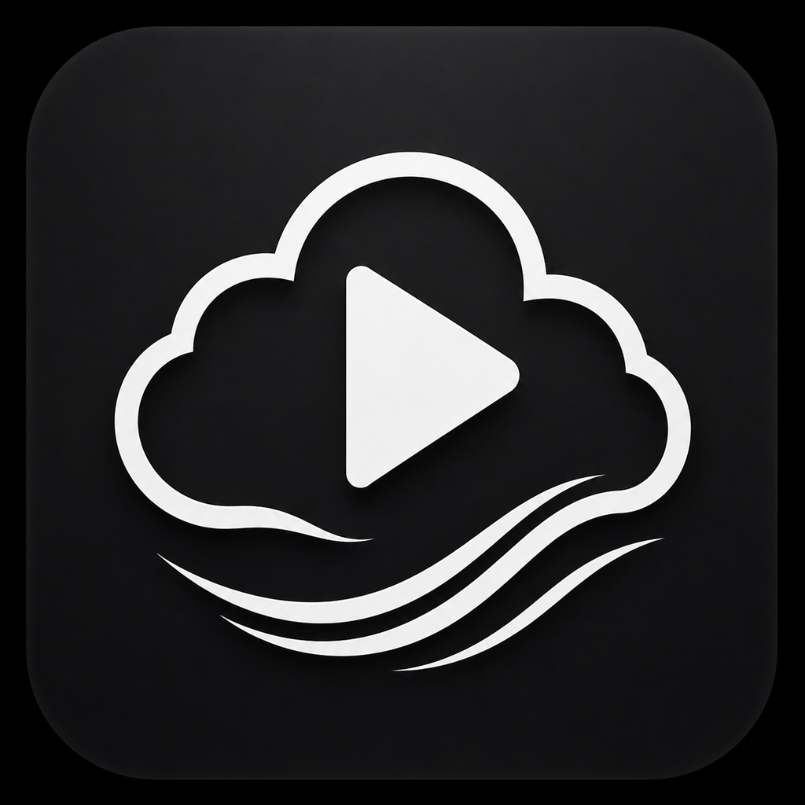

# ☁️ Cloud Player

  

  <strong>Your Media. Any Cloud.</strong> 
  A unified cloud media player for Android, Android TV, and Android Auto.

---

## Download

> **Latest Release**

➡️ **Download Cloud Player**

https://github.com/MikereDD/It-Works-On-My-Machine/releases/download/cloudplayer-v1.0/cloudplayer-v1.0.apk

*(Update this link after publishing the first release.)*

---

# Features

### ☁️ Unified Cloud Libraries

Connect multiple cloud storage providers and browse them from one application.

Current support:

* ✅ pCloud

Planned support:

* 🚧 MEGA
* 🚧 Google Drive
* 🚧 Dropbox
* 🚧 OneDrive
* 🚧 SMB
* 🚧 WebDAV
* 🚧 Nextcloud

---

# Supported Platforms

* 📱 Android
* 📺 Android TV
* 🚗 Android Auto

---

# Media Support

* 🎬 Movies
* 📺 TV Shows
* 🎵 Music
* 🎧 Audiobooks
* 📜 M3U Playlists

---

# Why Cloud Player?

Cloud Player is designed around one simple philosophy:

> **Your media belongs to you—not your storage provider.**

Whether your files are stored in pCloud today or spread across multiple services tomorrow, Cloud Player gives you one beautiful interface to browse, stream, and enjoy your media.

---

# Roadmap

### v1.x

* pCloud
* Android TV
* Android Auto
* Continue Watching
* Favorites
* Queue Management

### Upcoming

* MEGA
* Multiple Libraries
* Unified Search
* Provider Manager
* Offline Downloads

---

# License

See the LICENSE file for details.
