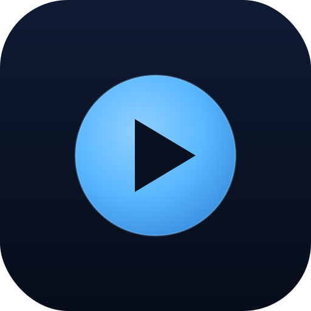

<p align="center">
  
</p>

<h1 align="center">Cloud TV</h1>

<p align="center"><strong>v0.2.0</strong></p>

<p align="center">
A minimal <strong>Google TV / Android TV</strong> media player (also runs on phones), built with
<strong>Kotlin + Jetpack Compose</strong>. Sign into your cloud storage, browse with the remote,
and stream <strong>video and audio</strong> straight from the cloud — played through the
<strong>VLC (LibVLC)</strong> engine for wide codec support.
</p>

<p align="center"><em>Forked from pCloud TV as a multi-cloud base.</em></p>

---

## Cloud providers

| Provider | Status |
|---|---|
| **pCloud** | ✅ Supported |
| **OneDrive** (Microsoft Graph) | 🔜 Planned |
| **Google Drive** | 🔜 Planned |
| **MEGA** | 🔜 Planned (phase 2) |

Each provider plugs in behind a common `CloudProvider` interface, so browse, playback,
playlists, resume, casting, and the multi-account switcher work the same regardless of where
the file lives.

---

## Features

- **Multiple accounts / quick switch** — sign into several accounts and switch from the ⋮ menu.
- Browse folders on TV (D-pad) or phone (touch), with file-type icons, sizes, and thumbnails.
- **VLC playback** with wide codec support; auto-hiding controls (play/pause, +/-10s, scrub bar).
- Auto-selects **English audio + subtitles** with a manual **Tracks** picker; resume where you stopped.
- **Background audio** — music/audiobooks keep playing with the screen off; video stops on leave.
- **Playlists** — play `.m3u`/`.m3u8` as a queue, build one by tapping tracks across folders, or bulk-generate per folder.
- **Recently played** with a Continue card.
- **Chromecast** — cast to a Chromecast / Google TV.

See the **[changelog](./CHANGELOG.md)** for the full release history.

---

## Build from source

1. Open the **CloudTV** folder in **Android Studio** (Hedgehog/Iguana or newer): *File → Open* → select the folder containing `settings.gradle.kts`.
2. Let Gradle **sync** (first sync downloads Gradle 8.4 + dependencies, including the LibVLC native libraries).
3. **Build → Build APK(s)** → output at `app/build/outputs/apk/debug/app-debug.apk`.

> **APK size:** ships **arm64-v8a + armeabi-v7a** native libs so it installs on phones, Android TVs, **and 32-bit ARM devices like the Chromecast with Google TV** (~110 MB). Drop an ABI in `app/build.gradle.kts` to trim it.

### Toolchain

| Component | Version |
|---|---|
| Gradle | 8.4 |
| Android Gradle Plugin | 8.2.2 |
| Kotlin | 1.9.22 |
| Compose Compiler extension | 1.5.10 |
| Compose BOM | 2024.02.00 |
| LibVLC (`org.videolan.android:libvlc-all`) | 3.6.0 |
| OkHttp | 4.12.0 |
| min / target SDK | 26 / 34 |
| JDK (Gradle) | 17 |

---

## Project layout

```
app/src/main/java/com/typezero/cloudtv/
+- MainActivity.kt
+- data/        # Models, SessionStore, CloudProvider interface + PCloudProvider
+- ui/          # App routing, login, browse, player, theme
+- cast/        # Chromecast wrapper
+- playback/    # background playback service
```

> The `CloudProvider` abstraction landed in **v0.2** — pCloud runs behind it now, and Google Drive / OneDrive / MEGA plug in as additional `CloudProvider` implementations.

---

## License

Personal project — do whatever you want with it.
