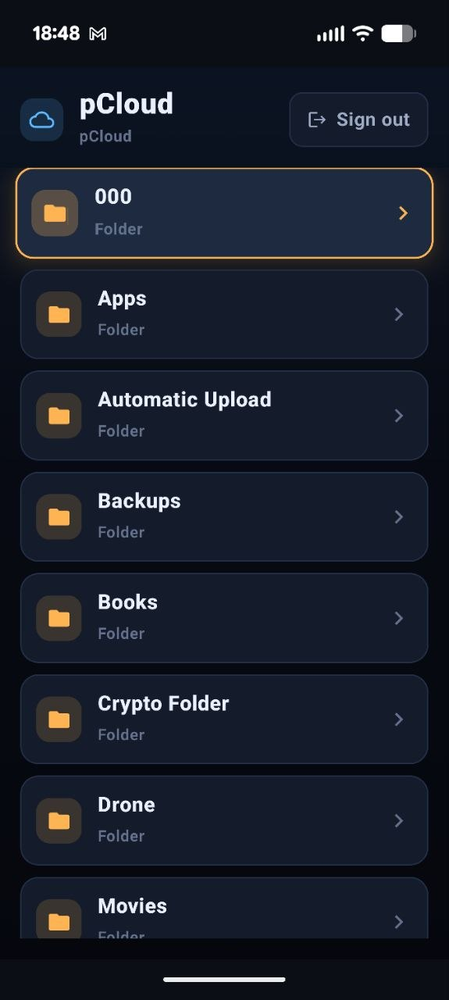
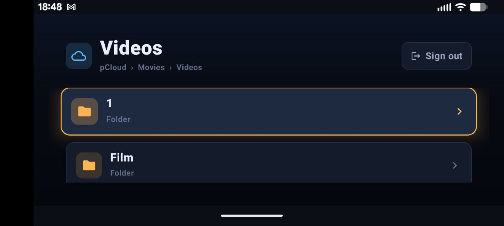
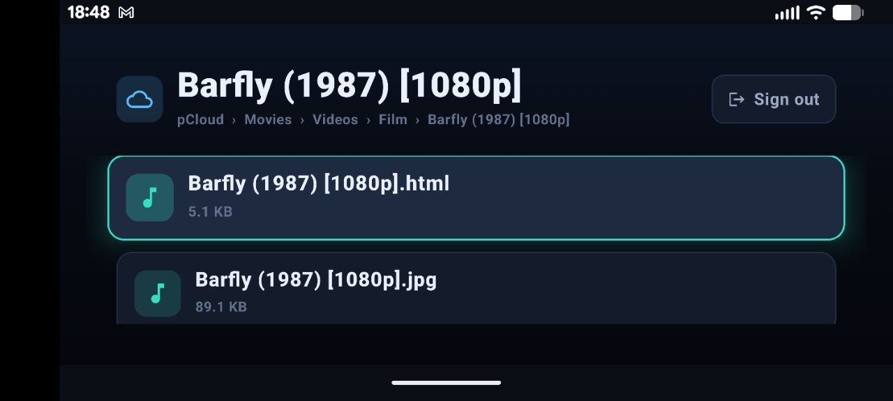
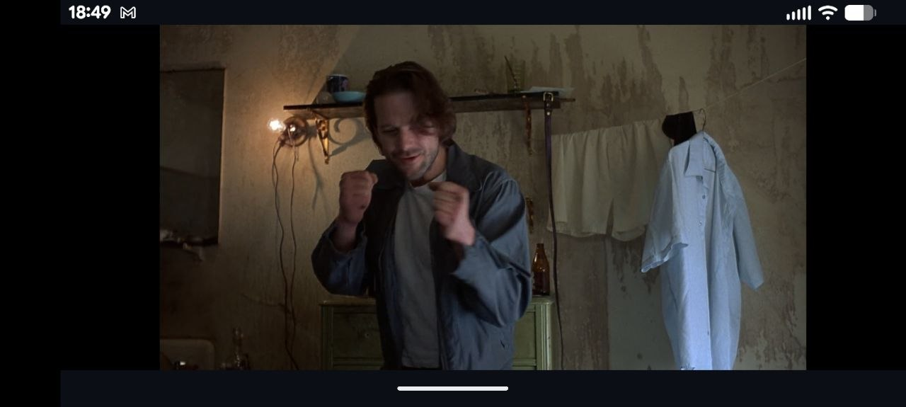

<p align="center">
  
</p>

<h1 align="center">pCloud TV</h1>

<p align="center"><strong>v1.0</strong></p>

<p align="center">
A minimal <strong>Google TV / Android TV</strong> app (also runs on phones), built with
<strong>Kotlin + Jetpack Compose</strong>. Sign into pCloud, browse your folders with the remote,
and stream your <strong>video and audio</strong> straight from pCloud — played through the
<strong>VLC (LibVLC)</strong> engine for wide codec support.
</p>

<p align="center">
  <a href="./releases/PCloudTV.apk"><strong>Download the APK (v1.0)</strong></a>
</p>

---

## Install

1. Download **[PCloudTV.apk](./releases/PCloudTV.apk)** and copy it to your phone or Android TV device.
2. Open it with a file manager and install. You'll see Google **Play Protect**'s "unknown developer" notice — tap **More details -> Install anyway**. That's expected for a sideloaded personal build.
3. Launch **pCloud TV**, tap **Sign in with pCloud**, and log in (two-factor authentication is handled on pCloud's own page).

> On Android TV, sideload via a file manager (e.g. "Downloader") or `adb install PCloudTV.apk`.

---

## Screenshots

| | |
|:---:|:---:|
|  |  |
|  |  |

---

## What's in v1.0

- Sign in through pCloud's own web login (**two-factor authentication supported**); token stored until sign-out.
- Browse folders on TV (D-pad) or phone (touch), with file-type icons and sizes.
- **VLC playback** with wide codec support.
- Auto-hiding player controls: play/pause, +/-10s seek, scrub bar.
- Auto-selects **English audio + English subtitles** (subtitles off when no English track), with a manual **Tracks** picker to override audio/subtitle per file — by touch on mobile and by remote on TV (**Up / Menu** to open).
- Polished, adaptive dark UI that scales between phone and TV.
- Free rotation on phones; rotating keeps your place (and keeps video playing).
- Keeps the screen awake during playback so the device won't sleep mid-video.

---

## Controls

**Player (TV remote):** **OK** play/pause - **Left / Right** seek +/-10s - **Up / Menu** audio & subtitle tracks - **Down** wake controls - **Back** exit.

**Player (touch):** tap to show/hide controls, tap the buttons, drag the seek bar, tap **Tracks** (top-right) for audio/subtitles.

---

## How sign-in works

pCloud has **disabled new OAuth app registration**, and its API does **not** support password login on accounts with **two-factor authentication**. So the app signs in via pCloud's own web login:

1. Tap **Sign in with pCloud** — the app opens **my.pcloud.com** in an in-app WebView.
2. Log in with your email + password + 2FA (all handled by pCloud).
3. The app captures the account's **access token** from the authenticated session, validates it against both regions (US `api.pcloud.com` / EU `eapi.pcloud.com`), and stores it.

The token is kept until you **Sign out** (which also clears the WebView session). Your **password is never seen or stored** — only the token. A manual *paste-a-token* field is included as a fallback.

---

## Build from source

1. Open the **PCloudTV** folder in **Android Studio** (Hedgehog/Iguana or newer): *File -> Open* -> select the folder containing `settings.gradle.kts`.
2. Let Gradle **sync** (first sync downloads Gradle 8.4 + dependencies, including the LibVLC native libraries — give it a few minutes).
3. **Build -> Generate App Bundles or APKs -> Build APK(s)** -> output at `app/build/outputs/apk/debug/app-debug.apk`.

> **APK size:** LibVLC bundles native libraries for every CPU ABI, so the debug APK is large (~60–90 MB). To shrink it for a specific device, add an ABI filter in `app/build.gradle.kts` under `defaultConfig`:
> ```kotlin
> ndk { abiFilters += "arm64-v8a" }   // arm64 covers modern phones + Google TV
> ```
> Don't restrict ABIs if you're testing on an **x86_64 emulator** — it would exclude the emulator's architecture.

### Toolchain

| Component | Version |
|---|---|
| Gradle | 8.4 |
| Android Gradle Plugin | 8.2.2 |
| Kotlin | 1.9.22 |
| Compose Compiler extension | 1.5.10 |
| Compose BOM | 2024.02.00 |
| LibVLC (`org.videolan.android:libvlc-all`) | 3.6.0 |
| OkHttp | 4.12.0 |
| min / target SDK | 26 / 34 |
| JDK (Gradle) | 17 |

---

## Project layout

```
app/src/main/java/com/typezero/pcloudtv/
+- MainActivity.kt          # hosts the Compose UI
+- data/
|  +- Models.kt             # PItem, Session, ApiResult
|  +- PCloudClient.kt       # listFolder / getStreamUrl / token validate (OkHttp + org.json)
|  +- SessionStore.kt       # token + region persistence (never the password)
+- ui/
   +- App.kt                # routing: login -> web login -> browse -> player
   +- AppViewModel.kt       # session state
   +- LoginScreen.kt        # "Sign in with pCloud" + token fallback
   +- WebLoginScreen.kt     # pCloud web login in a WebView (captures the token)
   +- BrowseScreen.kt       # folder stack + focusable cards
   +- PlayerScreen.kt       # LibVLC playback, controls, track picker
   +- theme/Theme.kt        # palette + design tokens
```

---

## Troubleshooting

- **`Unsupported class file major version` / JVM target mismatch** — set the Gradle JDK to **17**: *Settings -> Build, Execution, Deployment -> Build Tools -> Gradle -> Gradle JDK* (the bundled `jbr-17` works), then re-sync.
- **Gradle can't resolve `libvlc-all:3.6.0`** — that exact version may not be on Maven Central; open the LibVLC page on Maven Central and bump to the latest `3.6.x`. (Avoid the `4.0.0-eap` builds; the API differs.)
- **Subtitles show the wrong language** — open **Tracks** (Up/Menu on TV, or the top-right button on touch) and pick the track you want, or set subtitles to **Off**.
- **Video won't decode** — LibVLC handles most formats; if one misbehaves, try toggling hardware decoding in `PlayerScreen.kt` (`setHWDecoderEnabled`).
- **"Directory does not contain a Gradle build"** — you opened the wrong folder; open the one that directly contains `settings.gradle.kts` and `app/`.

---

## Notes

- Stream URLs from `getfilelink` are bound to the requesting device's IP, so the app resolves them immediately before playback on the same device.
- Token storage is plain app-private prefs. For encryption, wrap `SessionStore` with `EncryptedSharedPreferences` (`androidx.security:security-crypto`).
- pCloud also offers `getvideolink` / `gethlslink` for transcoded/adaptive streaming if you ever need it — `PCloudClient` is where to add it.

---

## License

Personal project — do whatever you want with it.
