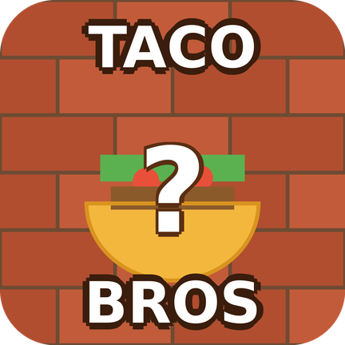
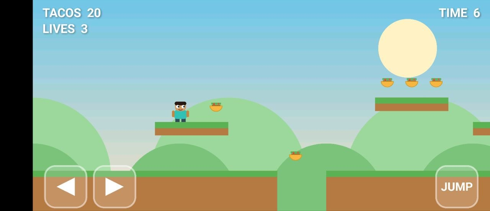
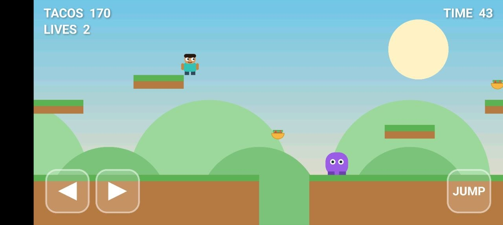

# Taco Bros

<p align="center">
  
</p>

A playable 2D side-scrolling Android platformer written in **Kotlin** using a custom
`SurfaceView` game loop and pure Canvas rendering. No game engine, no external art
assets, and no sprite packs — everything is drawn procedurally.

Play as **Miguel**, collect tacos, stomp enemies, avoid hazards, and reach the flag.

---

## Status

- **Release:** v1.0
- **State:** Playable

## Features

- Native Android Kotlin
- Custom `SurfaceView` game engine
- Custom ~60 FPS game loop
- Procedural graphics
- Tile-based levels
- Multi-touch controls
- Enemy AI and patrol behavior
- Score and lives system
- Camera scrolling
- Win / Game Over states

## Gameplay

- **Move:** Left / Right pads on the bottom-left
- **Jump:** JUMP button on the bottom-right
- Stomp enemies from above to defeat them
- Collect tacos for points
- Avoid pits and hazards
- Reach the flag to complete the level

### Scoring

| Action | Points |
|--------|--------|
| Taco | +10 |
| Enemy stomp | +20 |

## Screenshots

<p align="center">
  
  
</p>

## Download

Latest APK:

📦 **[Download Taco Bros APK](releases/Taco-Bros.apk)**

### Installation

1. Download `Taco-Bros.apk`
2. Enable installation from unknown sources on your Android device
3. Install the APK
4. Launch Taco Bros
5. Collect tacos and defeat enemies

## Requirements

- Android Studio Hedgehog / Iguana or newer
- JDK 17, preferably Android Studio's embedded JDK
- Android device or emulator running API 24+

## Build

```bash
./gradlew assembleDebug
./gradlew installDebug
```

## Project Layout

```text
app/src/main/java/com/example/tacobros/
  MainActivity.kt
  GameView.kt
  GameThread.kt
  Level.kt
  Entities.kt
  Controls.kt
```

## Roadmap

- Additional levels
- Sound effects
- Music
- Power-ups
- Moving platforms
- High scores
- Settings menu

## Credits

Created by Mike Redd.

Part of the **It Works On My Machine** project.
