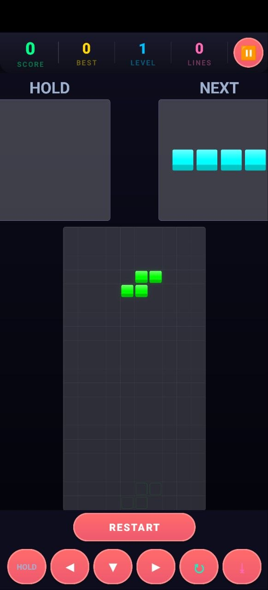

# 🧱 TetBlockRis v1.1
&gt; Falling blocks. Poor decisions. Retro chaos.

## 🧠 Overview
TetBlockRis is a lightweight Tetris-style game project focused on fast gameplay, simple visuals, arcade feel, and minimal bloat. Built as part of the `Games/Android` section of the repository.

## 📸 Gameplay Preview

## 🎮 Features
- Falling block gameplay
- Line clearing
- Score tracking
- Keyboard / touch controls
- Retro-inspired visuals

## ⚙️ Design Goals
TetBlockRis is intentionally simple. The goal is instant gameplay, low overhead, responsive controls, and no garbage mobile monetization. No ads. No battle pass. No login screen. Just blocks.

## 🛠️ Development
**Primary environment:** Android Studio, Java / Kotlin, Gradle

**APK output path:** `app/build/outputs/apk/debug/TetBlockRis.apk`

Possible future versions may experiment with Godot, LibGDX, HTML5 builds, or Desktop ports.

## 📦 Version
TetBlockRis v1.1 — Added gameplay preview image and README polish.

## ⚠️ Notes
- Early project
- Mechanics may change
- UI is intentionally minimal
- Bugs are expected

If the blocks disappear: that's probably not a feature.

## 🧩 Future Ideas
- Theme system
- Synthwave mode
- Local score saving
- Multiplayer experiments
- Pi scoreboard integration
- PowerShell terminal edition

## 🧠 Final
Modern games became stores pretending to be games. TetBlockRis is just a game.