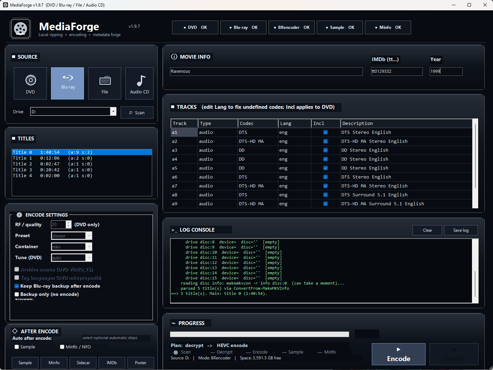

<p align="center">
  
</p>

<h1 align="center">MediaForge</h1>

<p align="center">
  <strong>Blu-ray, DVD, CD, metadata, samples, posters, and NFO tools in one PowerShell project.</strong>
</p>

<p align="center">
  
  
  
  
</p>

<p align="center">
  
</p>

---

## What it is

**MediaForge** is the media ripping and encoding toolbox for the *It Works On My Machine* repo.

It wraps the Blu-ray, DVD, CD, sample, metadata, poster, and NFO helper scripts into one project folder with a GUI front end and Tool Menu support.

```text
$HOME\PS\scripts\personaltools\MediaForge\
```

---

## Main launcher

```powershell
pwsh -NoProfile -ExecutionPolicy Bypass -STA -File "$HOME\PS\scripts\personaltools\MediaForge\mediaforge-gui.ps1"
```

Or double-click:

```text
MediaForge.vbs
```

The MediaForge GUI now uses the MediaForge name only:

```text
mediaforge-gui.ps1
```

Legacy `media-encoder*` launcher and icon files were removed after the project rename. Update any old shortcut or Tool Menu entry to point at `mediaforge-gui.ps1`.

---

## Features

| Area | What MediaForge does |
|---|---|
| **Blu-ray** | Backup, track dump, metadata sidecars, HEVC encode, audio/subtitle language handling |
| **DVD** | Rip and encode through the production DVD workflow |
| **Audio CD** | FLAC ripping, MusicBrainz lookup, album art workflow, track/image modes |
| **Samples** | Create MKV/MP4 sample clips from finished media, including post-encode GUI automation |
| **Metadata** | Create MiNFO / NFO/HTML reports for finished media, with IMDb ID or GUI title/year fallback |
| **IMDb / Posters** | Metadata lookup and poster grabbing through the helper tools |
| **GUI** | One polished front end for DVD, Blu-ray, file tools, and Audio CD workflows |
| **Tool Menu** | Scripts are grouped under MediaForge for clean launching |

---

## Included scripts

```text
MediaForge\
  mediaforge-gui.ps1              # main GUI
  MediaForge.vbs                  # double-click launcher

  bluray-backup.ps1
  bluray-trackdump.ps1
  BRencoder.ps1
  BRencoder-gui.ps1

  dvd-ripper-encoder.ps1
  dvd-ripper-encoder-gui.ps1

  cd-image-flac.ps1
  cd-tracks-flac.ps1
  cd-ripper-gui.ps1
  cd-ripper-gui.vbs

  mkv-sample.ps1
  minfocreate.ps1
  imdbdump.ps1
  imdbthumbgrab.ps1

  mediaforge.ico
  mediaforge.png

  assets\
    icons\
      dvd.png
      bluray.png
      file.png
      audiocd.png
    screenshots\
      mediaforge-v1.9.7.png
```

---

## Install

From PowerShell, after extracting the package:

```powershell
$src = "$HOME\Downloads\MediaForge-v1.10.23-minfo-imdbdump-json-handoff-fix\MediaForge"
$dst = "$HOME\PS\scripts\personaltools\MediaForge"

New-Item -ItemType Directory -Force $dst | Out-Null
Copy-Item "$src\*" "$dst\" -Recurse -Force

Get-ChildItem $dst -Recurse | Unblock-File
```

Launch it:

```powershell
pwsh -NoProfile -ExecutionPolicy Bypass -STA -File "$HOME\PS\scripts\personaltools\MediaForge\mediaforge-gui.ps1"
```

---

## Tool Menu

The Tool Menu should point MediaForge GUI entries at:

```text
MediaForge\mediaforge-gui.ps1
```

Console helper scripts should run from the MediaForge folder so local files, icons, logs, sidecars, and helper paths resolve correctly.

Recommended Tool Menu entries include:

```text
MediaForge (GUI)
MediaForge DVD Encoder
MediaForge Blu-ray Backup
MediaForge Blu-ray Track Dump
MediaForge Blu-ray Encoder
MediaForge MKV Sample
MediaForge IMDb Dump
MediaForge Poster Grab
MediaForge MiNfoCreate
```

---

## GUI notes

The v1.9.7 GUI keeps the proven v1.8/v1.9.1 layout and workflow intact while continuing the premium dark MediaForge theme direction.

This pass keeps:

```text
current workflow
current script wiring
source tile icons
flicker-safe timer behavior
progress card layout fix
```

The GUI supports:

```text
DVD       -> scan/rip/encode workflow
Blu-ray   -> backup/trackdump/encode workflow
File      -> sample/minfo side tools
Audio CD  -> CD ripper GUI / FLAC workflows
```

The **After Encode** panel supports optional automatic post-steps:

```text
Sample
Minfo / NFO
```

Manual helper buttons are also available:

```text
Create sample
Create minfo
Dump sidecar
IMDb
Poster
```

---

## Requirements

MediaForge expects the normal media toolchain to be installed and available through the configured paths or `%PATH%`.

Common tools:

```text
PowerShell 7+
MakeMKV
ffmpeg / ffprobe
mkvmerge / mkvpropedit
MediaInfo
cdda2wav
flac
metaflac
```

Some workflows can still run when optional helpers are missing, but production ripping and tagging works best when the full stack is installed.

---

## Project rule

MediaForge uses `$HOME`-based paths and should not hard-code a specific Windows user folder.

```text
Good:  $HOME\PS\scripts\personaltools\MediaForge
Bad:   C:\Users\Somebody\...
```

---

## Release notes


### v1.10.23 Minfo IMDbDump JSON Handoff Fix

- Keeps the three-tool metadata flow intact: `imdbdump.ps1` does OMDb lookup, `imdbthumbgrab.ps1` handles posters, and `minfocreate.ps1` builds NFO/HTML.
- Fixes MiNfoCreate treating valid IMDbDump JSON as a wrapper failure.
- Accepts OMDb `Response=True` JSON from IMDbDump even if the wrapper process returns a stale nonzero exit code.
- Keeps the locked MediaForge theme, layout, source icons, and workflow unchanged.

### v1.10.22 Minfo IMDbDump Child-Process Backend Fix

- Keeps the three-tool metadata design intact.
- Runs `imdbdump.ps1 -Json -NonInteractive` through a clean child PowerShell process from `minfocreate.ps1`.
- Prevents MediaForge GUI runspace argument/environment bleed from turning IMDb IDs or switches into title lookups.
- Uses the same known-good backend command that works standalone.

### v1.10.19 Minfo IMDbDump Env Backend Fix

- Fixed MiNfoCreate -> IMDbDump nested backend calls from MediaForge GUI.
- Uses IMDbDump environment backend mode instead of passing switch tokens that could be mis-bound in GUI runspaces.
- Keeps IMDb ID lookups as `i=tt...` through IMDbDump and title/year as fallback only.
- Keeps theme, layout, buttons, and icons unchanged.

### v1.10.18 Minfo IMDb ID Backend Fix

- Fixed the MediaForge → MiNfoCreate → IMDbDump backend call so IMDb IDs are passed as `-ImdbId` instead of being treated like a title.
- Cleared stale `IMDBDUMP_*` environment values before backend lookups.
- Kept the three-tool metadata flow: IMDbDump for movie data, IMDbThumbGrab for posters, MiNfoCreate for NFO/HTML.
- Kept theme, layout, icons, and workflow unchanged.

### v1.10.16 IMDbDump Backend Fix

- Keeps the three-tool metadata split intact.
- Fixes Minfo/MediaForge lookup calls by passing IMDbDump backend values through safe environment variables instead of nested switch arguments.
- Prevents `-Title`/`-ImdbId` switch tokens from being misread as movie IDs in GUI/non-interactive runs.
- Leaves the locked MediaForge theme/layout/buttons/icons unchanged.

### v1.10.15 Three-Tool Metadata Fix

- Restores the original helper split: `imdbdump.ps1` owns OMDb lookup, `imdbthumbgrab.ps1` remains the poster download/preview tool, and `minfocreate.ps1` owns NFO/HTML generation.
- Adds `-Json` / `-NonInteractive` backend mode to `imdbdump.ps1` so MediaForge can fetch movie metadata without opening the old console menu.
- Updates `minfocreate.ps1` to call `imdbdump.ps1` for OMDb data instead of maintaining a separate lookup path.
- Keeps the locked MediaForge theme, layout, source icons, and button workflow unchanged.


### v1.10.13 Minfo OMDb Config Passthrough Fix

- Stops MediaForge GUI from passing the OMDb API key through the runspace argument list.
- Lets minfocreate.ps1 load minforc.ps1 directly again, matching imdbthumbgrab behavior.
- Adds safer GUI logging for whether an OMDb key was configured without exposing the key.
- Guards against bad argument-shift cases that make the API key look like a movie title.

### v1.10.12 Minfo OMDb API Key Restore

- Passes the OMDb API key explicitly from `mediaforge-gui.ps1` into `minfocreate.ps1` during GUI Minfo runs.
- Restores the old known-good curl-based OMDb movie lookup path for single-file HTML/NFO generation.
- Sanitizes IMDb IDs before lookup and uses title/year fallback when available.
- Fails with real OMDb/curl details instead of writing another `No OMDb data` HTML page when metadata was supplied.

### v1.10.11 Minfo OMDb Parser Fix

- Fixes a PowerShell parser error in MiNfoCreate OMDb failure messages.
- Wraps `lookupLabel` before colons in thrown OMDb errors.
- Keeps the v1.10.10 curl-based OMDb restore path intact.

### v1.10.10 Minfo OMDb Curl Restore

- Restores the older known-good curl-based OMDb movie lookup path used by the original Minfo HTML generator.
- Removes the newer web-stack lookup path that could still produce MediaInfo-only HTML from the GUI.
- Passes IMDb ID and title/year together from MediaForge and requires OMDb success when GUI metadata is supplied.
- Fails loudly instead of writing a broken `No OMDb data` HTML page from MediaForge.
- Keeps the locked theme, layout, buttons, and source icons unchanged.

### v1.10.9 Minfo OMDb Hard Fix

- Restores reliable OMDb metadata lookup for GUI-created NFO/HTML files.
- Uses PowerShell/.NET web lookup first, then curl.exe as a fallback.
- If an explicit IMDb ID is supplied and OMDb cannot be resolved, MediaForge now fails loudly instead of silently generating a MediaInfo-only HTML page.
- Keeps the locked MediaForge theme, layout, source icons, and workflow unchanged.

### v1.10.8 Minfo OMDb URL Fix

- Restores the older known-good OMDb URL request path used by MiNfoCreate/ImdbThumbGrab.
- Fixes GUI-created HTML falling back to MediaInfo-only even when an IMDb ID is present.
- Adds stronger OMDb API key fallback handling for GUI/non-interactive runs.
- Keeps theme/layout/buttons/icons/workflow unchanged.

### v1.10.7 Minfo OMDb Restore

- Restores full OMDb movie metadata lookup for GUI-created Minfo/NFO/HTML files.
- Uses the IMDb ID field first, then falls back to GUI title/year or parsed file name.
- Switches Minfo OMDb calls to explicit curl argument binding for GUI runspaces.
- Logs OMDb lookup failures clearly instead of silently producing MediaInfo-only HTML.
- Keeps the locked MediaForge theme, layout, source icons, poster download, and workflow unchanged.


### v1.10.6 GUI Poster Download

- Runs `imdbthumbgrab.ps1` directly from the MediaForge GUI in non-interactive mode.
- Downloads the poster from the GUI without launching a separate console window.
- Uses the IMDb ID field when available, otherwise falls back to title/year.
- Logs the saved poster path in the MediaForge log console.
- Keeps the locked theme, layout, source icons, and workflow unchanged.

### v1.10.5 Minfo GUI Runspace Fix

- Fixes Minfo / NFO creation from the MediaForge GUI background runspace.
- Hardens `minfocreate.ps1 -NonInteractive` so it never calls console cursor / RawUI helpers.
- Keeps interactive console MiNfoCreate behavior unchanged.
- Keeps the locked MediaForge theme, layout, source icons, and workflow unchanged.

### v1.10.2 Minfo Argument Fix

- Fixed GUI Minfo/NFO creation passing IMDb arguments into `minfocreate.ps1`.
- Uses an explicit `-Mode single` call for file-mode NFO/HTML creation.
- Avoids the PowerShell automatic `$args` variable during runspace tool calls.
- Keeps the locked MediaForge theme/layout unchanged.

### v1.10.1 MediaForge Naming Cleanup

- Remove legacy `media-encoder*` wrapper and icon files after the project rename.
- Keep `mediaforge-gui.ps1`, `MediaForge.vbs`, `mediaforge.ico`, and `mediaforge.png` as the canonical launch/icon files.
- Rename Media Encoder leftovers in logs, comments, save-log filename, and dialog titles to MediaForge.
- Keep production theme, layout, workflow, and post-tool behavior unchanged.

### v1.10.0 Sample Log Cleanup

- Keep the MediaForge production theme and layout unchanged.
- Clean up successful sample generation so normal ffmpeg stderr output is not shown as scary `ERR` lines.
- Add stronger ffmpeg probe settings for sample creation to reduce subtitle stream warnings.
- Print ffmpeg output only when sample creation actually fails.

### v1.9.9 Post-Encode Tools Automation

- Makes the post-encode Sample and Minfo / NFO steps production-safe from the GUI.
- Adds GUI-safe non-interactive sample generation so the background runspace does not trip on console cursor helpers.
- Allows Minfo/NFO/HTML generation to use the GUI title/year when an IMDb ID is not entered.
- Logs created sample, NFO, HTML, and poster paths when helper tools return them.
- Leaves the locked MediaForge theme, layout, buttons, source icons, and workflow unchanged.

### v1.9.8 Metadata Language Safety Fix

- Hardens BRencoder metadata tagging against invalid one-letter language tags from CLPI / ffprobe edge cases.
- Prevents `mkvpropedit` from failing after a completed long encode because of tags like `language=e`.
- Falls back to matching sidecar metadata language when a physical stream language is partial or invalid.
- Uses `und` as the final safe fallback instead of writing an invalid language tag.
- Bumps BRencoder to v3.2.1.

### v1.9.7 Progress Layout Fix

- Keeps the premium MediaForge theme direction.
- Moves Encode and Cancel lower inside the Progress card so they do not crowd the progress bar.
- Compresses the stage strip so Scan / Decrypt / Encode / Sample / Minfo stay left of the action buttons.
- Prevents the progress bar from stretching under the action buttons on resize.
- Keeps layout, workflow, buttons, source icons, and script wiring unchanged.
- Adds the current GUI screenshot to the README.

### v1.9.6 Source Icon / Selection Tuning

- Source tile icons live in `assets/icons/`.
- Cleaner transparent Blu-ray source icon.
- Darker selected source tile.
- Keeps the v1.9.4 flicker fix and v1.9.5 icon workflow.

### v1.9.4 Premium Theme Flicker Fix

- Removes repeated full-theme repainting from the UI timer to prevent visual flashing/flicker.
- Enables flicker-safe double buffering where supported.
- Keeps layout, workflow, buttons, and script wiring unchanged.

---

## Philosophy

MediaForge is meant to be practical, local, and repairable.

It is not trying to be a streaming platform. It is a personal media workshop: rip the disc, preserve the tracks, tag the output, create the sidecars, and keep the workflow understandable.

> If it works on my machine, it gets forged here.

### v1.10.23 — Minfo IMDbDump JSON handoff fix

- Fixes the final handoff where valid IMDbDump OMDb JSON was being treated as an error.
- If IMDbDump returns `Response=True`, MiNfoCreate now uses that movie metadata to build the full NFO/HTML.
- Does not change the GUI theme or workflow.

### v1.10.22 — Minfo IMDbDump backend last-mile fix

- Keeps the three-tool metadata flow intact: `imdbdump.ps1`, `imdbthumbgrab.ps1`, and `minfocreate.ps1`.
- Changes the MiNfoCreate → IMDbDump wrapper to pass lookup data through `IMDBDUMP_*` environment variables only.
- Hardens IMDbDump so a value like `tt0129332` is always treated as an IMDb ID even if it arrives through a title fallback.
- Keeps the locked MediaForge theme/layout/buttons/icons unchanged.
