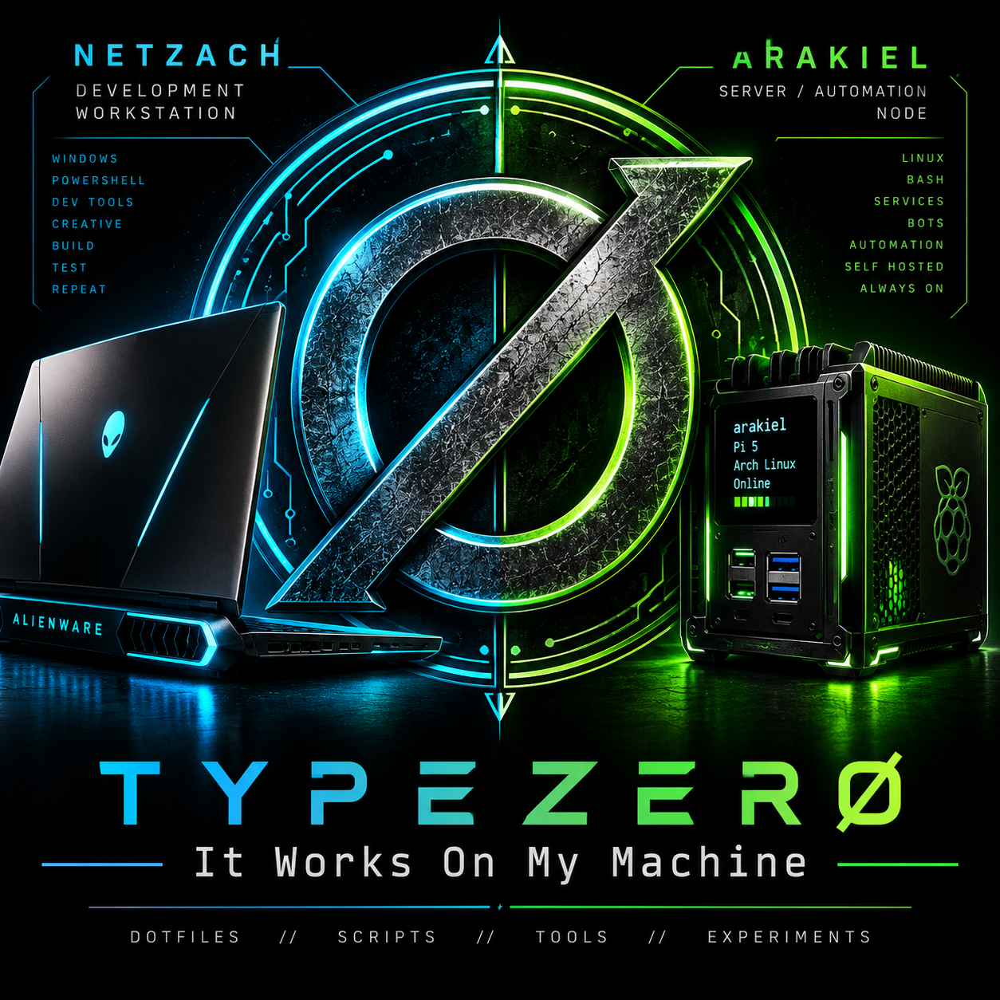

<p align="center">
  
</p>

# It-Works-On-My-Machine

> **If it defines or helps operate Netzach or Arakiel, it belongs here. If it grows into a standalone application or project, it graduates out.**

`It-Works-On-My-Machine` is the working systems repository for **Netzach**, the Windows development workstation, and **Arakiel**, the Arch Linux / Raspberry Pi 5 server and automation node.

This is where dotfiles, shell environments, administration scripts, personal tools, machine setup, reusable pieces, experiments, and prototypes live. It is also a workshop: small ideas can begin here, prove themselves useful, and eventually become standalone repositories without losing the lineage that started them.

## Systems

### Netzach — Development Workstation

Windows development, build, testing, media tooling, and daily workstation automation.

- PowerShell profile and modular `profile.d` configuration
- Administration and utility scripts
- Personal tools and historical PowerShell prototypes
- Vim configuration
- Machine setup and workstation-specific experiments

The PowerShell versions of projects such as **Cadence**, **MediaForge**, **Parallax**, and **AtomicClock** remain here as part of their development lineage even when their modern descendants live in standalone repositories.

### Arakiel — Server / Automation Node

Arch Linux on Raspberry Pi 5, providing the always-on side of the environment.

- Bash and Zsh environments
- tmux, Vim, i3, X11, and Wi-Fi configuration
- Raspberry Pi administration and health tools
- Network, backup, update, and system utilities
- Media and personal shell tools
- Service and setup material for the server

## Repository Layout

```text
It-Works-On-My-Machine/
├── Netzach/
│   ├── PowerShell/
│   │   ├── profile.d/
│   │   └── scripts/
│   ├── config/
│   │   └── vim/
│   ├── setup/
│   └── experiments/
├── Arakiel/
│   ├── bash.d/
│   ├── zsh.d/
│   ├── bin/
│   ├── scripts/
│   ├── lib/
│   ├── config/
│   │   ├── i3/
│   │   ├── shell/
│   │   ├── tmux/
│   │   ├── vim/
│   │   ├── wifi-menu/
│   │   └── x11/
│   ├── services/
│   └── setup/
├── Shared/
│   ├── scripts/
│   ├── tools/
│   ├── dotfiles/
│   └── templates/
├── Experiments/
│   ├── 3D-Printing/
│   ├── Android/
│   ├── Games/
│   └── prototypes/
├── assets/
├── docs/
├── .gitattributes
├── .gitignore
├── LICENSE
└── README.md
```

## Shared

`Shared/` is reserved for material that genuinely belongs to both machines: reusable scripts, common tools, portable dotfiles, and templates. Machine-specific files stay with their machine rather than being forced into a common abstraction.

## Experiments

`Experiments/` is the workshop. It currently preserves 3D-printing projects, Android work including **PCloudTV**, Android and PowerShell games, and space for new prototypes.

An experiment does not need to become a product. If one grows into a maintained standalone application, it can graduate into its own repository while the useful prototype or historical ancestor can remain here when it documents how the project began.

## Philosophy

This repository is intentionally practical rather than generic. The files here are built around the machines they actually run on.

**Discover → Build → Use → Refine → Graduate**

The name remains the rule:

> Everything in here works. On my machine.

## License

[WTFPL](./LICENSE) — do what the fuck you want.
