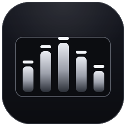
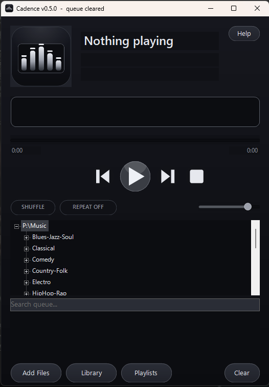
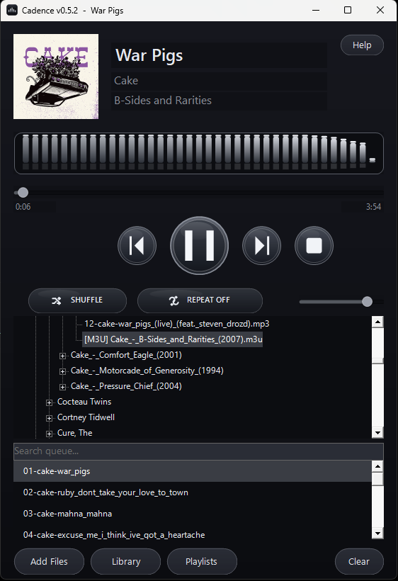

# Cadence

<p align="center">
  
</p>

A sleek, fully owner-drawn local audio player for Windows — monochrome
Material-style UI, NAudio engine, live FFT visualizer, and a real library
browser. Part of the `personaltools/` toolkit.

**Latest: v0.3.0** · [Changelog](https://github.com/MikereDD/It-Works-On-My-Machine/blob/main/Windows/Powershell/scripts/personaltools/Cadence/CHANGELOG.md)

## Screenshots

| Library &amp; search | Now playing |
|:---:|:---:|
|  |  |

## Highlights
- **Wide format support** — MP3, FLAC, M4A/AAC, WAV, WMA, OGG, OPUS via NAudio
  and system codecs.
- **Live spectrum visualizer** — a real FFT off a pass-through tap, drawn as
  gradient bars with rounded tops and floating peak-hold caps in a recessed
  well (no fake animation).
- **Library browser** — a lazy-loaded folder tree with saved roots persisted to
  config, so a large collection is navigated rather than flattened.
- **Queue search** — a live filter box narrows the queue to matching tracks as
  you type; playback stays correct while filtered.
- **Playlist queue** — shuffle, repeat-all, auto-advance, full-path dedupe, and
  M3U / M3U8 import.
- **Monochrome Material UI** — tonal pill buttons, a FAB transport, toggle
  chips, recessed dark-grey wells, and a subtle depth gradient.
- **Tags + album art** — via TagLibSharp when present, with a filename fallback.

## Requirements
- Windows with **Windows PowerShell 5.1** available — it's the reliable STA host
  for the WinForms paint handlers. Start the player from any shell (pwsh or
  Windows PowerShell); if the launching shell isn't STA, it relaunches itself
  hidden into Windows PowerShell `-STA`.
- NAudio + TagLibSharp DLLs in `.\lib` (fetched by `setup-naudio.ps1`).

## Setup & run
```powershell
# one-time: fetch NAudio + TagLibSharp into .\lib
.\setup-naudio.ps1

# unblock (needed whenever files arrive via a browser/download), then run
Get-ChildItem . -Recurse -Include *.ps1,*.dll | Unblock-File
.\cadence.ps1
```
Keep `Unblock-File` on its own line — it must finish before launch, and a
machine-scope GPO enforces execution policy regardless of `-ExecutionPolicy
Bypass`. If the launching shell isn't already STA, the script relaunches itself
hidden into Windows PowerShell `-STA` so only the player window shows. For a
fire-and-forget launch, double-click **`cadence.cmd`** or run `cadence` from
this folder — it backgrounds the player and returns the shell immediately.

> Run only `cadence.ps1` — it dot-sources the engine and UI modules
> itself. Don't `& .\*.ps1`, or the modules and the setup script run too.

## Controls
| Input | Action |
|-------|--------|
| `Space` | Play / pause |
| `Ctrl+Left` / `Ctrl+Right` | Previous / next |
| `M` | Mute toggle |
| Type in the search box | Live-filter the queue |
| `Esc` (in search box) | Clear the filter |
| Double-click file / `.m3u` | Play |
| Right-click folder (tree) | Add recursively |
| Library button | Add / remove / clear saved roots |

## Layout
| File | Role |
|------|------|
| `cadence.ps1` | Main GUI — layout, wiring, position + visualizer timers |
| `player.engine.ps1` | NAudio playback engine + FFT spectrum tap |
| `player.ui.ps1` | Theme palette, owner-drawn controls, live visualizer |
| `setup-naudio.ps1` | NuGet dependency fetcher (`-> .\lib`) |

Runtime files written next to the script: `cadence.config.json` (saved library
roots) and `cadence-startup.log` (startup/exception log).

## Visualizer
A compiled C# tap copies samples into a ring buffer as they play; a UI timer
runs an FFT, folds it into log-spaced bands, and paints center-mirrored grey
spikes (bass mid-grey to treble near-white) inside a recessed, light-bordered
well. If the tap fails to compile it falls back to an idle baseline — audio is
never routed through anything that could interrupt playback.

## Changelog
See [CHANGELOG.md](https://github.com/MikereDD/It-Works-On-My-Machine/blob/main/Windows/Powershell/scripts/personaltools/Cadence/CHANGELOG.md).
