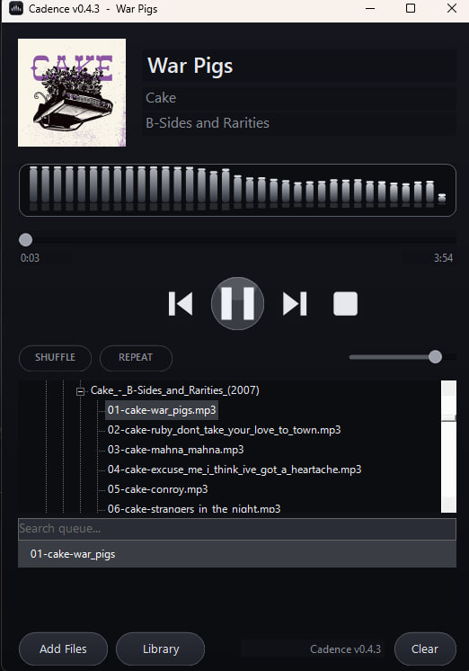

# Cadence

<p align="center">
  
</p>

A sleek, fully owner-drawn local audio player for Windows — monochrome
Material-style UI, NAudio engine, live FFT visualizer, and a real library
browser. Part of the `personaltools/` toolkit.

**Latest: v0.5.0** · [Changelog](https://github.com/MikereDD/It-Works-On-My-Machine/blob/main/Windows/Powershell/scripts/personaltools/Cadence/CHANGELOG.md)

## Screenshots

| Library &amp; search | Now playing |
|:---:|:---:|
|  |  |

## Highlights
- **Wide format support** — MP3, FLAC, M4A/AAC, WAV, WMA, OGG, OPUS via NAudio
  and system codecs.
- **Live spectrum visualizer** — a real FFT off a pass-through tap, drawn as
  gradient bars with rounded tops and floating peak-hold caps in a recessed
  well (no fake animation). Switchable palettes: monochrome, full spectrum,
  indigo.
- **Library browser** — a lazy-loaded folder tree with saved roots persisted to
  config, so a large collection is navigated rather than flattened.
- **Queue search** — a live filter box narrows the queue to matching tracks as
  you type; playback stays correct while filtered.
- **Playlist queue** — shuffle, repeat off/all/one, auto-advance, full-path dedupe,
  M3U / M3U8 import, drag-and-drop of files / folders / playlists, app-managed
  saved playlists in `cadence.playlists`, and a polished queue right-click menu.
- **Remembers your setup** — saved library roots plus volume, shuffle, repeat mode,
  visualizer palette, queue, selected track, and last position persist across launches.
- **Stability polish** — config is validated on load, saved atomically, unreadable
  config files are backed up, playlist writes are safer, and errors are logged
  with clearer categories.
- **Monochrome Material UI** — tonal pill buttons, a FAB transport, toggle
  chips, recessed dark-grey wells, and a subtle depth gradient.
- **Tags + album art** — via TagLibSharp when present, with filename fallback, deeper embedded-art extraction, and broad sidecar cover fallback (`cover.jpg`, `folder.png`, `AlbumArt_*.jpg`, one-image album folders, etc.).
- **Built-in help** — a Help button opens `HELP.md`, About Cadence, the app folder, or the startup log.

## Requirements
- Windows with **Windows PowerShell 5.1** available — it's the reliable STA host
  for the WinForms paint handlers. Start the player from any shell (pwsh or
  Windows PowerShell); if the launching shell isn't STA, it relaunches itself
  hidden into Windows PowerShell `-STA`.
- NAudio + TagLibSharp DLLs in `.\lib` (fetched by `setup-naudio.ps1`).

## Setup & run
```powershell
# one-time: fetch NAudio + TagLibSharp into .\lib
.\setup-naudio.ps1

# unblock (needed whenever files arrive via a browser/download), then run
Get-ChildItem . -Recurse -Include *.ps1,*.dll | Unblock-File
.\cadence.ps1
```
Keep `Unblock-File` on its own line — it must finish before launch, and a
machine-scope GPO enforces execution policy regardless of `-ExecutionPolicy
Bypass`. (Cadence also strips the mark-of-web from its own files at startup, so
the visualizer's spectrum tap compiles even if you forget.) If the launching
shell isn't already STA, the script relaunches itself hidden into Windows
PowerShell `-STA` so only the player window shows.

> Run only `cadence.ps1` — it dot-sources the engine and UI modules
> itself. Don't `& .\*.ps1`, or the modules and the setup script run too.

## Controls
For the full button guide, right-click menus, album-art behavior, and keyboard shortcuts, see [HELP.md](HELP.md).

| Input | Action |
|-------|--------|
| `Space` | Play / pause |
| `Ctrl+Left` / `Ctrl+Right` | Previous / next |
| `M` | Mute toggle |
| `S` | Toggle shuffle |
| `R` | Cycle repeat mode: Off -> All -> One |
| `Ctrl+S` | Save the current queue as a named Cadence playlist |
| `Ctrl+O` | Open a playlist file and replace the queue |
| `Delete` | Remove the selected queue item |
| `Ctrl+C` | Copy the selected queue item path |
| `F1` | Open `HELP.md` |
| Type in the search box | Live-filter the queue |
| `Esc` (in search box) | Clear the filter |
| Double-click file / `.m3u` | Play |
| Drag files / folders onto the window | Add to queue |
| Right-click queue | Play/remove selected tracks, open file location, copy path, show track info, toggle shuffle/repeat, save/export playlists, or clear the queue |
| Right-click visualizer | Switch palette (mono / spectrum / indigo) |
| Right-click album art | Choose a local cover image, retry online lookup, or toggle online art lookup |
| Right-click folder (tree) | Add recursively |
| Library button | Add / remove / clear saved roots |
| Playlists button | New playlist, open playlist, save current queue, load saved playlists, toggle session restore, or open the playlists folder |
| Help button | Open `HELP.md`, About Cadence, the app folder, or the startup log |

## Queue tools
Right-click a queue item for local-library actions: play it, remove it from the queue, open its file location in Explorer, copy the full path, or show track metadata. The same menu also keeps the queue-wide actions: shuffle, repeat mode, save current queue as a Cadence playlist, export M3U, and clear queue.

## Album art
Cadence first uses embedded artwork from the audio tag. It prefers a real front cover, then tries every other embedded picture until one decodes. If no embedded artwork is available, it looks near the playing file for common sidecar names such as `cover.jpg`, `folder.jpg`, `front.png`, `album.png`, `albumart.jpg`, `artwork.jpg`, `AlbumArt.jpg`, `AlbumArtSmall.jpg`, Windows Media Player `AlbumArt_*.jpg`, and one-image album folders.

The window title and a small bottom-right label show the running version. Hover the album-art box to see whether the image came from embedded tags, a sidecar file, or was not found. When no cover is available, the album-art panel shows the Cadence icon instead of an empty square. The same lookup result is logged to `cadence-startup.log`.

## Playlists
Cadence can now keep named custom playlists in `cadence.playlists` next to the
script. Use the **Playlists** button to start a new empty queue, open an existing
`.m3u` / `.m3u8`, save the current queue as a named Cadence playlist, load a
saved playlist, add a saved playlist to the current queue, export the queue as a
standalone M3U file, or open the playlists folder in Explorer.

## Last session restore
On exit, Cadence saves the current queue, selected track, playback position,
volume, shuffle/repeat mode, visualizer palette, and album-art lookup setting in
`cadence.config.json`. On the next launch it restores the queue and selected
track without autoplaying. Press **Play** to resume from the saved position. Use
**Playlists -> Restore last session on launch** to toggle this behavior.

## Layout
| File | Role |
|------|------|
| `cadence.ps1` | Main GUI — layout, wiring, position + visualizer timers |
| `HELP.md` | Button guide, right-click menus, keyboard shortcuts, and troubleshooting |
| `cadence.config.example.json` | Example config format; real `cadence.config.json` is runtime-only |
| `.gitignore` | Keeps Cadence runtime/cache files out of the repo |
| `player.engine.ps1` | NAudio playback engine + FFT spectrum tap |
| `player.ui.ps1` | Theme palette, owner-drawn controls, live visualizer |
| `setup-naudio.ps1` | NuGet dependency fetcher (`-> .\lib`) |

Runtime files written next to the script: `cadence.config.json` (saved library
roots plus volume / shuffle / repeat mode / visualizer palette / online art lookup / last-session snapshot),
`cadence.playlists` (app-managed saved `.m3u8` playlists), `cadence.art-cache`
(cached online album covers), and `cadence-startup.log` (startup/exception log).
If `cadence.config.json` is corrupt or unreadable, Cadence backs it up as
`cadence.config.bad-YYYYMMDD-HHMMSS.json` and starts with safe defaults instead
of failing at launch.

## Visualizer
A compiled C# tap copies samples into a ring buffer as they play; a UI timer
runs an FFT, folds it into log-spaced bands, and draws them as gradient bars
with rounded tops and floating peak-hold caps (with a faint mirrored
reflection) inside a recessed, light-bordered well. A gamma curve expands the
dynamic range so the silhouette actually moves with the music. Right-click to
switch palettes (monochrome / full spectrum / indigo). If the tap fails to
compile it falls back to an idle baseline — audio is never routed through
anything that could interrupt playback.

## Changelog
See [CHANGELOG.md](https://github.com/MikereDD/It-Works-On-My-Machine/blob/main/Windows/Powershell/scripts/personaltools/Cadence/CHANGELOG.md).
