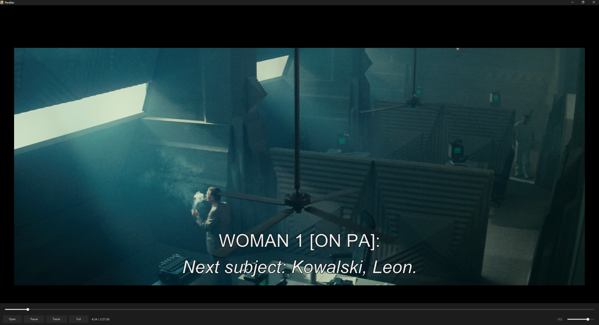
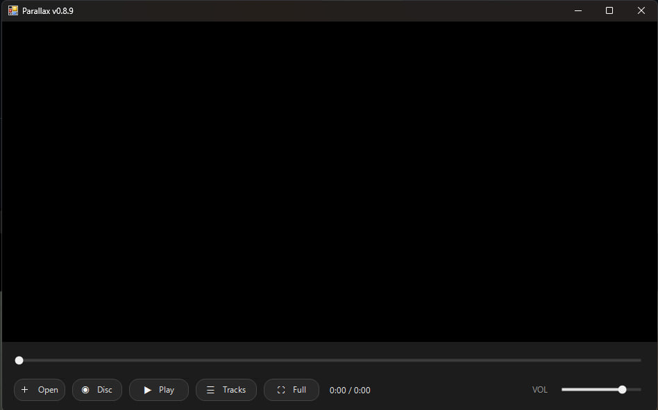
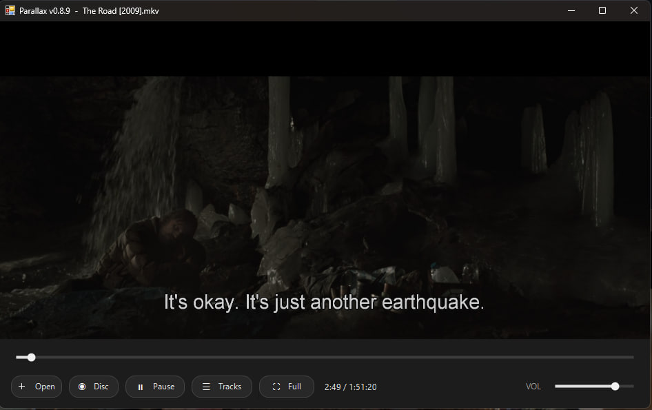
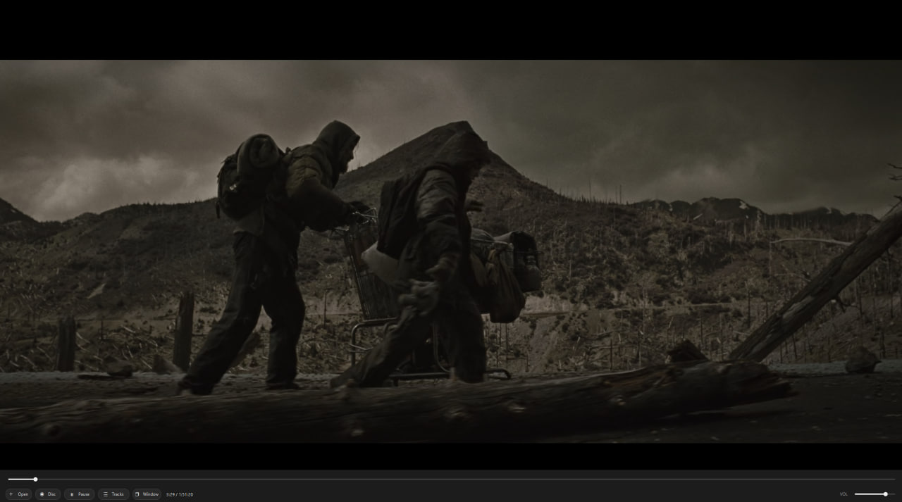
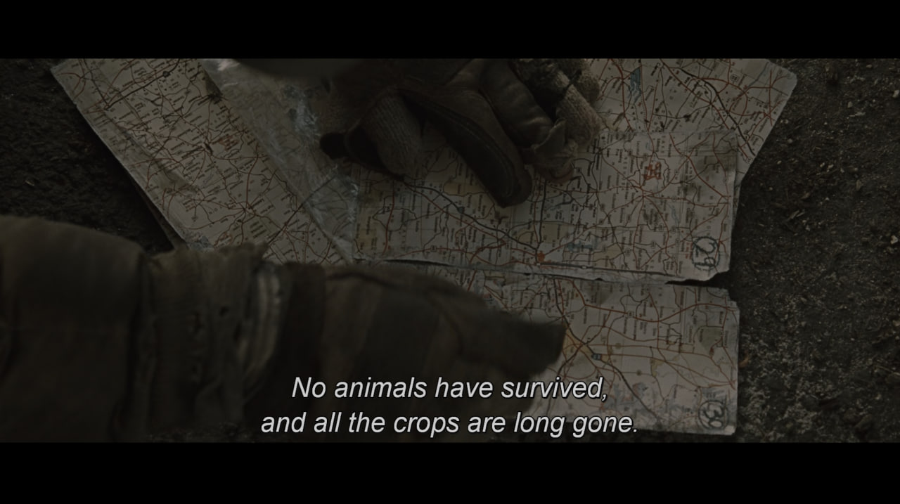

<p align="center">
  
</p>

<h1 align="center">Parallax</h1>

<p align="center">
  A lightweight Windows video player &mdash; a single-file PowerShell + WinForms<br>
  front-end that embeds <b>libmpv</b>. The video sibling to <a href="../Cadence">Cadence</a>.
</p>

<p align="center">
  
  
  
  
</p>



## Features


- Plays anything libmpv handles (MKV, MP4, M2TS, TS, WebM, ...) via HWND embedding
- **Resume** &mdash; reopening a file picks up where you left off (per-file watch-later)
- **Disc** &mdash; play DVDs and Blu-rays straight from the drive, with title,
  episode, and chapter navigation
- **Tracks** popup for switching audio and subtitle streams, with Off for subs
- App version shown beside the Parallax name in the Windows title bar
- Now-playing name shown in the title bar and at the top of the Tracks popup
- Fullscreen with auto-hiding controls and cursor
- Owner-drawn monochrome seek + volume sliders (click-to-seek, drag-scrub)
- Rounded owner-drawn command buttons with icon labels and hover/press polish
- Unicode button glyphs now assigned safely so the icons render correctly in Windows PowerShell 5.1
- DWM dark title bar, Material 3 monochrome styling

### Keyboard

| Key | Action |
| --- | --- |
| `Space` | Play / pause |
| `Left` / `Right` | Seek &minus;5s / +5s |
| `Up` / `Down` | Volume &minus;5 / +5 |
| `F` | Toggle fullscreen |
| `Esc` | Exit fullscreen |

See the [changelog](https://github.com/MikereDD/It-Works-On-My-Machine/blob/main/Windows/Powershell/scripts/personaltools/Parallax/CHANGELOG.md) for full history.

## Screenshots

<table>
  <tr>
    <td align="center">
      <br>
      <sub><b>1. Blank opened app</b></sub>
    </td>
    <td align="center">
      <br>
      <sub><b>2. App playing in minimal window</b></sub>
    </td>
  </tr>
  <tr>
    <td align="center">
      <br>
      <sub><b>3. App playing in full screen showing the buttons at the bottom</b></sub>
    </td>
    <td align="center">
      <br>
      <sub><b>4. App full screen</b></sub>
    </td>
  </tr>
</table>

## Requirements

- Windows PowerShell 5.1 (the script self-relaunches under `powershell.exe -STA`
  if started from pwsh 7)
- `libmpv-2.dll` (64-bit) next to `parallax.ps1` &mdash; **not** committed; see setup

## Setup

1. Download the dev runtime from
   [shinchiro/mpv-winbuild-cmake](https://github.com/shinchiro/mpv-winbuild-cmake/releases)
   &mdash; grab the `mpv-dev-x86_64-<date>.7z` asset (the `-dev-` one, not `-v3-`).
2. Extract and copy **`libmpv-2.dll`** into this folder, alongside `parallax.ps1`.

## Run

```
parallax.cmd
```

Or directly: `powershell.exe -STA -File parallax.ps1`. Click **Open**, pick a file,
and it plays into the embedded panel. Playback position is saved automatically.

### Discs

The **Disc** button lists optical drives and plays a DVD or Blu-ray, auto-detecting
the type from `VIDEO_TS` / `BDMV`. Once a disc is playing, the **Tracks** popup gains:

- **Titles** &mdash; the disc's individual titles, for multi-title discs
- **Episodes** &mdash; for a single-title "Play All" disc, use **Split evenly** to
  divide the title into N even episode jumps (or leave it on auto gap-detection)
- **Chapters** &mdash; every chapter, with timestamps

Commercial discs are encrypted and need extra libraries on PATH (or beside
`libmpv-2.dll`):

- **DVD** &mdash; `libdvdcss.dll` for CSS-encrypted discs
- **Blu-ray** &mdash; `libaacs.dll` plus a valid `KEYDB.cfg` for AACS discs

Unencrypted and self-authored discs play without these. Most retail Blu-rays
will not play in-player even with libaacs &mdash; rip them with MakeMKV instead.
