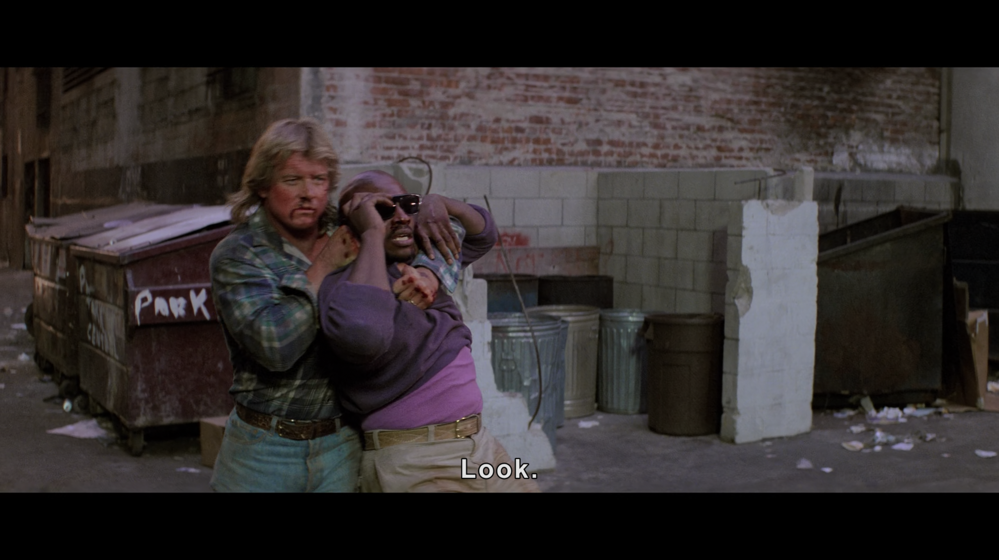
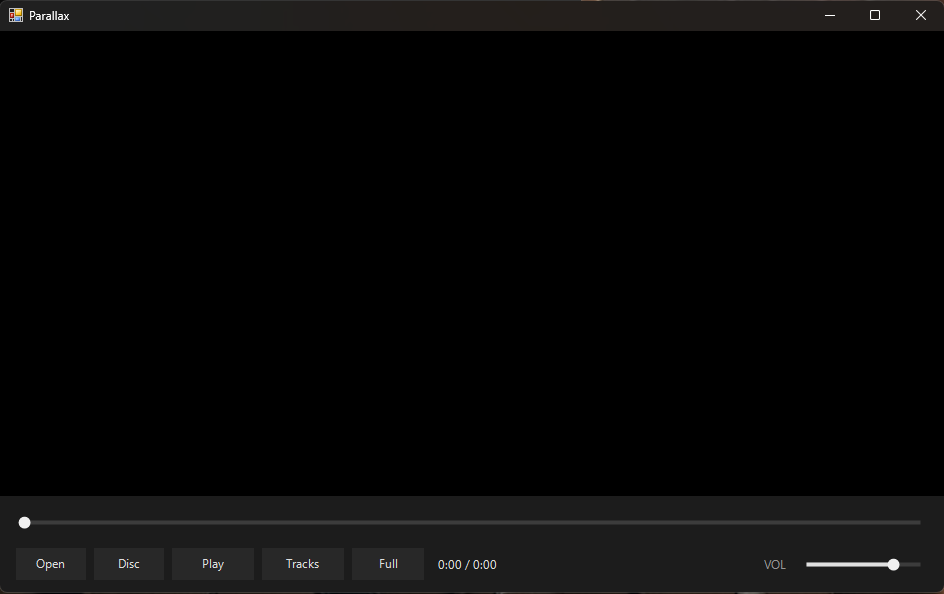

<p align="center">
  
</p>

<h1 align="center">Parallax</h1>

<p align="center">
  A lightweight Windows video player &mdash; a single-file PowerShell + WinForms<br>
  front-end that embeds <b>libmpv</b>. The video sibling to <a href="../Cadence">Cadence</a>.
</p>

<p align="center">
  
  
  
  
</p>


## Features

- Plays anything libmpv handles (MKV, MP4, M2TS, TS, WebM, ...) via HWND embedding
- **Resume** &mdash; reopening a file picks up where you left off (per-file watch-later)
- **Tracks** popup for switching audio and subtitle streams, with Off for subs
- Fullscreen with auto-hiding controls and cursor
- Owner-drawn monochrome seek + volume sliders (click-to-seek, drag-scrub)
- DWM dark title bar, Material 3 monochrome styling

### Keyboard

| Key | Action |
| --- | --- |
| `Space` | Play / pause |
| `Left` / `Right` | Seek &minus;5s / +5s |
| `Up` / `Down` | Volume &minus;5 / +5 |
| `F` | Toggle fullscreen |
| `Esc` | Exit fullscreen |

See the [changelog](https://github.com/MikereDD/It-Works-On-My-Machine/blob/main/Windows/PowerShell/personaltools/Parallax/CHANGELOG.md) for full history.

## Screenshots

<table>
  <tr>
    <td><br><sub>Fullscreen with auto-hiding controls</sub></td>
    <td><br><sub>The interface at rest</sub></td>
  </tr>
</table>

## Requirements

- Windows PowerShell 5.1 (the script self-relaunches under `powershell.exe -STA`
  if started from pwsh 7)
- `libmpv-2.dll` (64-bit) next to `parallax.ps1` &mdash; **not** committed; see setup

## Setup

1. Download the dev runtime from
   [shinchiro/mpv-winbuild-cmake](https://github.com/shinchiro/mpv-winbuild-cmake/releases)
   &mdash; grab the `mpv-dev-x86_64-<date>.7z` asset (the `-dev-` one, not `-v3-`).
2. Extract and copy **`libmpv-2.dll`** into this folder, alongside `parallax.ps1`.

## Run

```
parallax.cmd
```

Or directly: `powershell.exe -STA -File parallax.ps1`. Click **Open**, pick a file,
and it plays into the embedded panel. Playback position is saved automatically.
